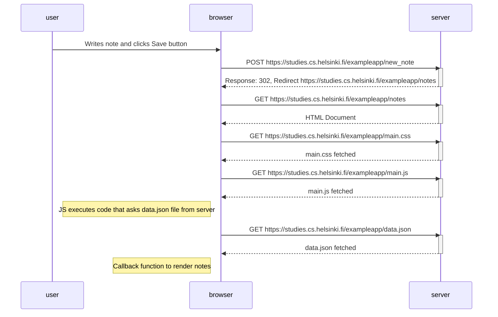

```mermaid
sequenceDiagram
    participant user
    participant browser
    participant server

    user->>browser: Writes note and clicks Save button

    browser->>server: POST https://studies.cs.helsinki.fi/exampleapp/new_note
    activate server
    server-->>browser: Response: 302, Redirect https://studies.cs.helsinki.fi/exampleapp/notes
    deactivate server
    browser->>server: GET https://studies.cs.helsinki.fi/exampleapp/notes
    activate server
    server-->>browser: HTML Document
    deactivate server
    browser->>server: GET https://studies.cs.helsinki.fi/exampleapp/main.css
    activate server
    server-->>browser: main.css fetched
    deactivate server
    browser->>server: GET https://studies.cs.helsinki.fi/exampleapp/main.js
    activate server
    server-->>browser: main.js fetched
    deactivate server
    Note left of browser: JS executes code that asks data.json file from server
    browser->>server: GET https://studies.cs.helsinki.fi/exampleapp/data.json
    activate server
    server-->>browser: data.json fetched
    deactivate server
    Note left of browser: Callback function to render notes
```
