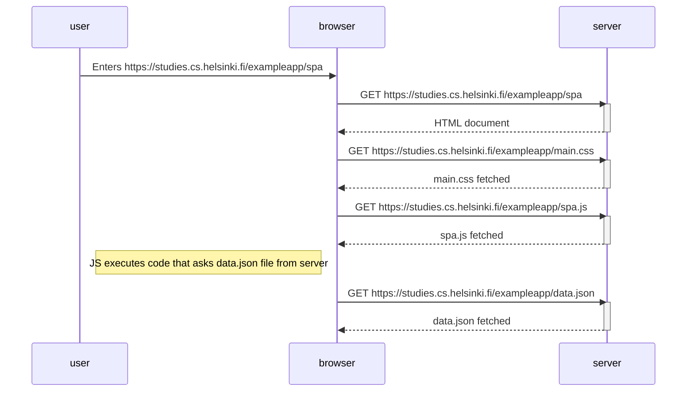

```mermaid
  sequenceDiagram
      participant user
      participant browser
      participant server
  
      user->>browser: Enters https://studies.cs.helsinki.fi/exampleapp/spa
  
      browser->>server: GET https://studies.cs.helsinki.fi/exampleapp/spa
      activate server
      server-->>browser: HTML document
      deactivate server
      browser->>server: GET https://studies.cs.helsinki.fi/exampleapp/main.css
      activate server
      server-->>browser: main.css fetched
      deactivate server
      browser->>server: GET https://studies.cs.helsinki.fi/exampleapp/spa.js
      activate server
      server-->>browser: spa.js fetched
      deactivate server
      Note left of browser: JS executes code that asks data.json file from server
      browser->>server: GET https://studies.cs.helsinki.fi/exampleapp/data.json
      activate server
      server-->>browser: data.json fetched
      deactivate server
```
